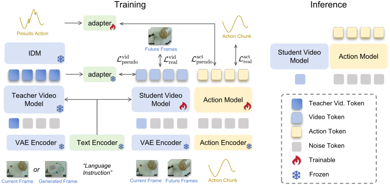

# Vid2WAM: Distilling Video Diffusion Priors into World Action Models

<p align="center">
  
</p>

This repository contains the implementation code for Vid2WAM: Distilling Video Diffusion Priors into World Action Models.


## Release Progress

- [x] Checkpoints and evaluation code
- [ ] Teacher and IDM training code
- [ ] Pseudo-data generation code
- [ ] Distillation training code

## Checkpoints

Download each checkpoint together with its matching normalization statistics. Our model checkpoints on both regimes for LIBERO/LIBERO-Plus and RoboTwin can be downloaded with:

```bash
python - <<'PY'
from huggingface_hub import snapshot_download

snapshot_download(
    repo_id="FaLLAut/vid2wam_ckpts",
    local_dir="checkpoints/vid2wam_ckpts",
    allow_patterns=["*.pt", "dataset_stats/*.json"],
)
PY
```


## Environment Setup

Clone the repository:

```bash
git clone https://github.com/qch-FA/Vid2WAM.git
cd Vid2WAM
pip install -e .
```

Then download the Wan2.2 VAE, BF16 UMT5-XXL encoder, and tokenizer:

```bash
python - <<'PY'
from huggingface_hub import snapshot_download

snapshot_download(
    repo_id="noodlepop/Wan-Series-Converted-Safetensors",
    local_dir="checkpoints/DiffSynth-Studio/Wan-Series-Converted-Safetensors",
    allow_patterns=[
        "Wan2.2_VAE.safetensors",
        "models_t5_umt5-xxl-enc-bf16.safetensors",
    ],
)
snapshot_download(
    repo_id="Wan-AI/Wan2.1-T2V-1.3B",
    local_dir="checkpoints/Wan-AI/Wan2.1-T2V-1.3B",
    allow_patterns="google/umt5-xxl/*",
)
PY

export DIFFSYNTH_MODEL_BASE_PATH="$PWD/checkpoints"
export DIFFSYNTH_SKIP_DOWNLOAD=true
```

## Evaluation

### LIBERO

Code related to LIBERO evaluation is in `third_party/LIBERO`. You may follow the instructions from the [LIBERO repository](https://github.com/Lifelong-Robot-Learning/LIBERO) to finish installation.

After installation, for one-task evaluation(take LIBERO-Goal, task 0 as example):

```bash
python benchmarks/libero/evaluate_task.py \
  ckpt=/path/to/libero_checkpoint \
  EVALUATION.dataset_stats_path=/path/to/dataset_stats.json \
  EVALUATION.task_suite_name=libero_goal \
  EVALUATION.task_id=0 \
  EVALUATION.num_trials=50 \
  EVALUATION.output_dir=./evaluate_results/libero_single \
  gpu_id=0
```

Run evaluation for all four LIBERO suites:

```bash
python benchmarks/libero/launch_suite.py \
  ckpt=/path/to/libero_checkpoint \
  EVALUATION.dataset_stats_path=/path/to/dataset_stats.json \
  EVALUATION.num_trials=50 \
  MULTIRUN.num_gpus=8 \
  MULTIRUN.max_tasks_per_gpu=1
```

### LIBERO-Plus

Code related to LIBERO-Plus evaluation is in `third_party/LIBERO-plus`. You may follow the instructions from the [LIBERO-Plus repository](https://github.com/sylvestf/LIBERO-plus) to finish installation. Note that LIBERO-Plus and LIBERO evaluation share the same checkpoint, but environments and assets are different.

Run the full LIBERO-Plus evaluation over all 10,030 trials:

```bash
SESSION_NAME=vid2wam_libero_plus_full_eval \
  python benchmarks/libero_plus/launch_suite.py \
  ckpt=/path/to/libero_checkpoint \
  EVALUATION.dataset_stats_path=/path/to/dataset_stats.json \
  EVALUATION.libero_plus_root=./third_party/LIBERO-plus \
  EVALUATION.all_trials=true \
  MULTIRUN.num_gpus=8 \
  MULTIRUN.max_tasks_per_gpu=1
```

`EVALUATION.all_trials=true` evaluates every entry in the official LIBERO-Plus `task_classification.json` exactly once.

The full evaluation is very time-consuming. You can also run the partial evaluation with 50 trials per task:

```bash
SESSION_NAME=vid2wam_libero_plus_eval \
  python benchmarks/libero_plus/launch_suite.py \
  ckpt=/path/to/libero_checkpoint \
  EVALUATION.dataset_stats_path=/path/to/dataset_stats.json \
  EVALUATION.libero_plus_root=./third_party/LIBERO-plus \
  EVALUATION.num_trials=50 \
  EVALUATION.perturbation_seed=42 \
  MULTIRUN.num_gpus=8 \
  MULTIRUN.max_tasks_per_gpu=1
```

`EVALUATION.num_trials=50` samples the seven perturbation categories uniformly for every original task and records the exact selection in `perturbation_manifest.json`.


### RoboTwin 2.0

Code related to RoboTwin 2.0 evaluation is in `third_party/RoboTwin`. You may follow the instructions from the [RoboTwin repository](https://github.com/RoboTwin-Platform/RoboTwin) to finish installation.

After installation, for one-task evaluation(take Click Alarmclock, clean setting as example):

```bash
python benchmarks/robotwin/evaluate_task.py \
  ckpt=/path/to/robotwin_checkpoint \
  EVALUATION.dataset_stats_path=/path/to/dataset_stats.json \
  EVALUATION.robotwin_root=./third_party/RoboTwin \
  EVALUATION.task_name=click_alarmclock \
  EVALUATION.task_config=demo_clean \
  EVALUATION.eval_num_episodes=100 \
  EVALUATION.output_dir=./evaluate_results/robotwin_single \
  gpu_id=0
```

Run the full evaluation:

```bash
python benchmarks/robotwin/launch_suite.py \
  ckpt=/path/to/robotwin_checkpoint \
  EVALUATION.dataset_stats_path=/path/to/dataset_stats.json \
  EVALUATION.robotwin_root=./third_party/RoboTwin \
  EVALUATION.eval_num_episodes=100 \
  MULTIRUN.num_gpus=8 \
  MULTIRUN.max_tasks_per_gpu=1
```

## Acknowledgements

The evaluation code in this repository was developed with reference to [FastWAM](https://github.com/yuantianyuan01/FastWAM), [Wan2.1](https://github.com/Wan-Video/Wan2.1), [Wan2.2](https://github.com/Wan-Video/Wan2.2), [DiffSynth-Studio](https://github.com/modelscope/DiffSynth-Studio), [LIBERO](https://github.com/Lifelong-Robot-Learning/LIBERO), [LIBERO-Plus](https://github.com/sylvestf/LIBERO-plus) and [RoboTwin](https://github.com/RoboTwin-Platform/RoboTwin). We thank the authors for their open-source implementation.
